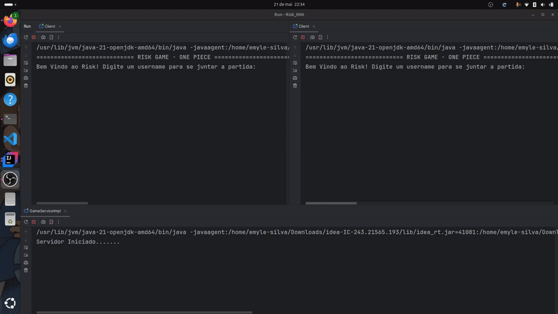
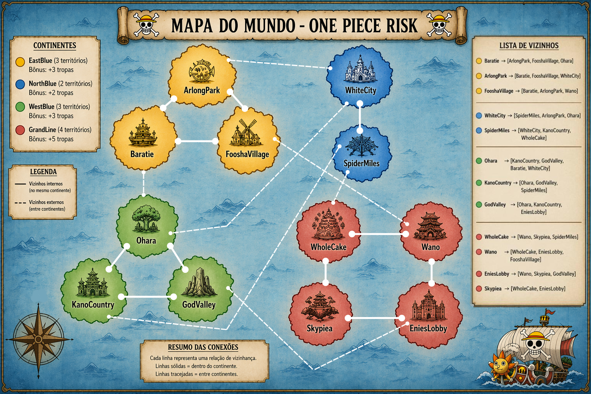

# Jogo Risk Distribuido - RMI


O **Risk RMI** é uma versão simplificada do jogo de tabuleiro Risk (War no Brasil), desenvolvida para a disciplina de Sistemas Distribuídos.  
O objetivo principal do projeto é elaborar um jogo distribuído utilizando o *Remote Method Invocation (RMI)* do Java.

## 👀 Preview



## 🤖 Tecnologias Utilizadas

- Java 21
- Java RMI (Remote Method Invocation)
- Programação Concorrente (Threads)
- Arquitetura Cliente-Servidor
- Callbacks para comunicação assíncrona 

## 📂 Estrutura do Projeto
```text
.
├── src/
│   └── main/java/com/RiskRmi/
│       ├── client/
│       │   ├── Client.java
│       │   ├── ClientCallbackImpl.java
│       │   └── UserCLI.java
│       ├── enums/
│       │   ├── FasesJogo.java
│       │   ├── Territorios.java
│       │   ├── TipoCarta.java
│       │   └── TipoTropa.java
│       ├── exceptions/
│       │   └── InvalidActionException.java
│       ├── model/
│       │   ├── Continente.java
│       │   ├── Dado.java
│       │   ├── Jogador.java
│       │   ├── Territorio.java
│       ├── Rmi/
│       │   ├── ClientCallback.java
│       │   └── GameService.java
│       └── server/
│           ├── GameManager.java
│           ├── NotificacoesCallback.java
│           ├── GameServiceImpl.java
│           └── Validate.java
├── assets/
│   ├── demo.gif
│   └── map.jpg
├── README.md
├── pom.xml
└── .gitignore
```

- A lógica do jogo é mantida pelo servidor, no diretório **server**. 
- O lado do cliente é gerenciado separadamente, no diretório **client**. Aqui são exibidos os menus, as invocações aos métodos remotos e a interação direta com o usuário.
- No diretório **RMI** ficam as interfaces para acesso aos metódos remotos, onde:
    
    - ***GameService.java:*** Interface para acesso aos métodos remotos disponibilizados pelo servidor.
    -  ***ClientCallback.java:*** Interface remota utilizada para implementação de callback RMI. Dessa forma, o servidor consegue acessar os clientes registrados para atualizações no jogo, evitando que os clientes fiquem em polling para obter mudanças de estado.

> Os demais diretórios são complementares para a construção do jogo, como validações, entidades, etc.

## 🎲 Funcionamento do Jogo

### 🗺️ Mapa



> Obs.: Mapa gerado com auxilio de inteligência artificial. 


### 📜 Regras 

As regras e funcionalidades do jogo são descritas a seguir:

1. O jogo deve ter no mínimo 2 jogadores e no máximo 4. O número total de jogadores deve ser definido em QUANTIDADE_JOGADORES na classe server/GameManager.java.
O jogo inicia automáticamente quando a quantidade de jogadores definida é atingida. 

2. O jogo é composto por 4 fases principais:

    - **Posicionamento Inicial:** Ocorre assim que o jogo é iniciado. Cada jogador recebe uma quantidade inicial de tropas que deve ser distribuída pelos seus territórios.
    Nessa fase, o jogador da vez deve escolher a opção *"Posicionar Tropas Iniciais"*.
    
        É permitido posicionar tropas em qualquer território sob domínio do jogador (a distribuição é feita pelo servidor). Ao posicionar todas as tropas disponíveis, o turno passa para o próximo jogador, até que todos concluam essa etapa.

    - **Início dos Turnos**: Após o posicionamento inicial, o jogo passa a alternar entre turnos (com as 3 fases restantes) e jogadores.

    - **Posicionamento:** Primeira fase do turno. O jogador recebe tropas e pode posicioná-las em seus territórios. As regras são:
        
        - Quantidade de territórios do jogador dividida por 3, sendo 3 o mínimo de tropas por turno.
        - Caso o jogador possua todos os territórios de um (ou mais) continentes, recebe o bônus correspondente.
        - O jogador pode trocar cartas para receber uma bonificação extra de 2 tropas (necessário possuir 3 cartas iguais). A troca ocorre apenas uma vez por turno.

    - **Ataque:** O jogador escolhe um território vizinho para atacar.
    O servidor define automaticamente a quantidade de tropas envolvidas (máximo possível em ambos os lados).
        - Ataque: até 3 tropas (3 dados)
        - Defesa: até 2 tropas (2 dados)
        
        Para cada par de dados:
        
        - Ataque > Defesa → defesa perde 1 tropa
        - Ataque ≤ Defesa → ataque perde 1 tropa

        Se o atacante eliminar todas as tropas do território, ele o conquista, recebe uma carta de recompensa e move suas tropas sobreviventes para o novo território.
    
    - **Movimentação:** O jogador pode fortificar um território movendo tropas entre territórios vizinhos.
    
        Essa ação pode ser realizada apenas uma vez por turno.

    > Após a fase de movimentação, o turno é encerrado e o próximo jogador inicia.

3. Além das fases principais, o jogador pode utilizar opções adicionais:

    - **Passar a vez:** Encerra o turno atual (exceto na fase de *posicionamento inicial*).
    - **Próxima Fase:** Avança para a próxima fase do turno (exceto no *posicionamento inicial*).
     
        - Caso esteja na última fase, o turno é encerrado automaticamente.
    - **Mostrar Estado do Jogo:** Exibe informações detalhadas do jogo (territórios, jogadores, continentes, tropas, etc.).

4. O jogo termina quando um jogador conquista todos os territórios. 

## ⚙️ Pré-Requisitos, Compilação e Execução

1. Pré-Requisitos

    - Java 21 ou superior
    - IDE com suporte a Java (IntelliJ, Eclipse, VS Code, etc.)

2. Compilação e Execução

    - Compile o projeto pela sua IDE.
    - Para executar:
        - Inicie o servidor executando server/GameServiceImpl.java.
        - Em seguida, inicie um cliente executando client/Client.java para cada jogador. 
        - O jogo começa automaticamente ao atingir o número mínimo de jogadores.

> [!IMPORTANT]
> Para que o sistema funcione corretamente em rede:
>
> - O IP da máquina que executa o servidor deve ser definido através da constante `IP_SERVIDOR` na classe do servidor: server/GameServiceImpl.java e na classe do cliente: client/Client.java.
>
> - Ao executar o cliente, é necessário informar como argumento o IP da máquina do próprio cliente, pois ele é utilizado pelo RMI Callback para que o servidor consiga se conectar de volta ao cliente.
>
> Exemplo de passagem do IP como argumento no cliente:
>
> ```bash
> java Client 192.168.0.15
> ```
>
> Onde:
>
> - `192.168.0.15` → IP da máquina que está executando o cliente.

> [!NOTE]
> Se o projeto estiver sendo executado através de uma IDE, o IP do cliente também pode ser informado pelos argumentos de execução da aplicação.
>
> No IntelliJ IDEA:
>
> 1. Abra:
>
>    `Run → Edit Configurations`
>
> 2. Selecione a classe principal do cliente.
>
> 3. No campo `Program arguments`, informe o IP da máquina cliente.
>
> Exemplo:
>
> ```txt
> 192.168.0.15
> ```

## 🔧 Detalhes Técnicos do Jogo

### 🕹️ **RMI**

A classe `server/GameServiceImpl.java` implementa os métodos definidos em GameService, delegando a lógica principal para `GameManager.java.`

Inicialização do servidor:
```java
System.setProperty(
    "java.rmi.server.hostname",
    IP_SERVIDOR
);

Registry registry =
    LocateRegistry.createRegistry(1099);

GameServiceImpl risk =
    new GameServiceImpl();

registry.rebind("risk", risk);
```

No cliente:

```java
static String name = "rmi://localhost/risk";
static GameService risk = null;

risk = (GameService) Naming.lookup(name);
```

```java
System.setProperty(
    "java.rmi.server.hostname",
    ip_client
);

Registry registry =
    LocateRegistry.getRegistry(
        IP_SERVIDOR,
        1099
    );

risk = (GameService)
    registry.lookup("risk");
```

O cliente também implementa métodos remotos para callback, funcionando como um listener no servidor.

```java
ClientCallback callback =
    new ClientCallbackImpl(user);

jogadorId =
    risk.registrarJogador(
        nomeJogador,
        callback
    );
```

No servidor:
```java
public int registrarJogador(String nome, ClientCallback cliente)
        throws RemoteException, InvalidActionException {

    Jogador jogador = new Jogador(nome, cliente);
    manager.registrarCliente(cliente);
    // restante do código
}
```

### 🕹️ **Threads**

Para permitir o encerramento do jogo, cada cliente roda em uma thread.

Uma variável jogoAtivo controla a execução. Quando um jogador vence, o servidor dispara o callback:

```java
void onEndGame(String mensagem) throws RemoteException;
```

No cliente:

```java
public void encerrarJogo(String mensagem) {
    System.out.println(mensagem);

    jogoAtivo = false;

    if (clienteThread != null) {
        clienteThread.interrupt();
    }

    input.close();
}
```


